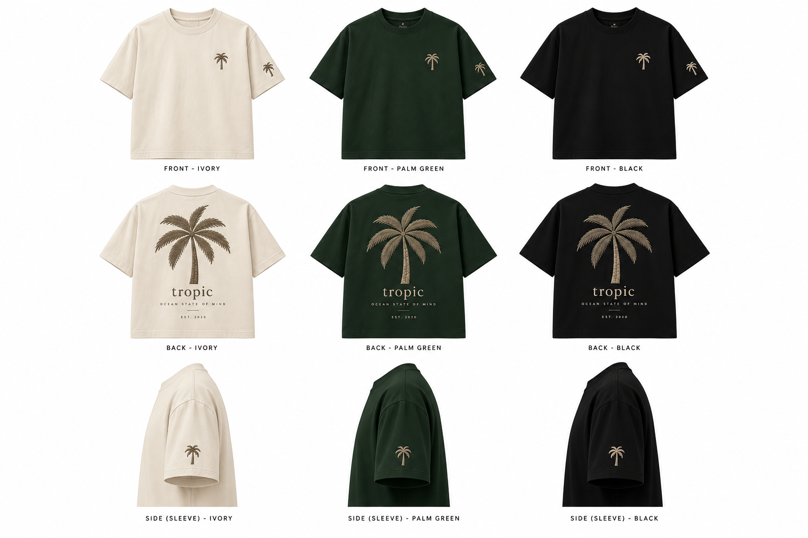
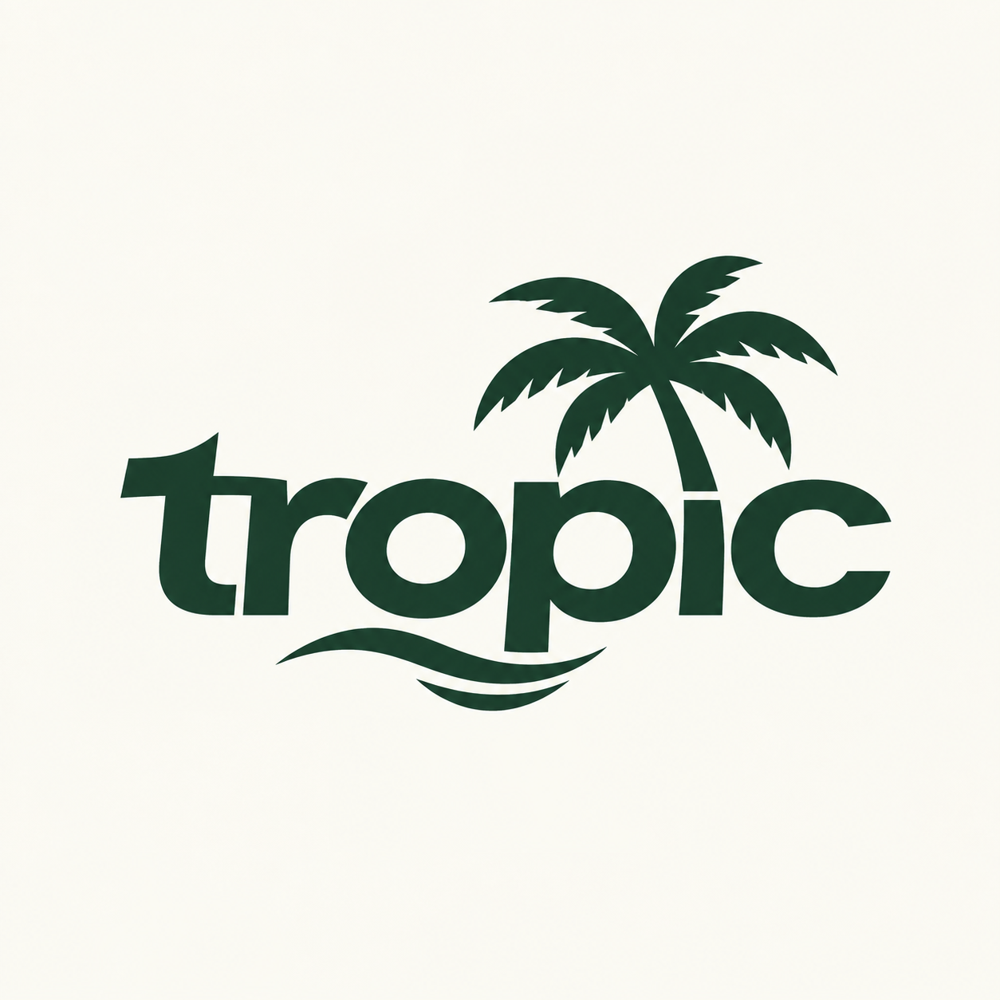

# Tropic — Business Plan

> **Positioning:** Beach-club and events smart-casual. Clothes you can wear to a day party, a rooftop or a beach club and still look clean and well dressed. Heavyweight blanks, tonal embroidery, no loud prints.

---

## 1. Fix these before you spend anything

| Issue | Why it matters | Action |
|---|---|---|
| **Name / trademark** | "Tropic" is already a large UK brand (Tropic Skincare). If they or anyone else holds the mark in **Class 25 (clothing)**, you could be forced to rebrand after you've built the audience. | Search the UKIPO and EUIPO registers for "Tropic" in Class 25 before ordering. If it's clear, file your own Class 25 mark (around £170 for one class online). If it's taken, change the name now. Something like "Tropic Club" or another variant is cheaper to change before launch than after. |
| **Two different logos** | The mockups use a lowercase serif "tropic" with "Ocean State of Mind". The logo file uses a chunky sans wordmark with a wave. A premium brand needs one identity. | Pick one. The **serif + palm** version suits "smart casual" better. Keep the chunky wave logo for swim shorts, towels and caps later, if at all. |
| **"Est. 2020"** | If the brand didn't exist in 2020, this is misleading to customers and looks bad if anyone checks. | Change it to the real launch year (e.g. **Est. 2026**) or drop it. |
| **Embroidery detail** | The back palm has fine tonal texture on the leaves and trunk, and "OCEAN STATE OF MIND" is tiny tracked caps. Embroidery can't hold text under about 5–6 mm tall, and fine shading blurs. | Ask the embroiderer to **digitise a simplified back palm** and make the tagline at least 6 mm tall, or print the tagline instead. Get a **sew-out photo** before the full run. |

---

## 1a. Starting on £150 (the plan you can actually run now)

£150 won't cover 6 tees with full embroidery: the blanks alone are £117. So start smaller, spend only on what shows up in photos, and let pre-orders pay for production.

### What to spend it on
| Item | Est. cost |
|---|---|
| 3 × Heavy Tee, one per colour (Ivory, Palm Green, Black), in M or L | £58.50 (less on a trade price) |
| Digitise **one** small palm file (for chest and sleeve) | £15–£30 |
| Chest + sleeve embroidery × 3 | £20–£35 |
| Back design as **DTF print** instead of embroidery (no digitising fee) | £15–£25 |
| **Total** | **≈ £110–£150** |

- The large embroidered back is the most expensive part (digitising and stitching could take most of your budget), so print the back for now. Embroidered front with a printed back is common on premium tees. Upgrade the back to embroidery once sales pay for it.
- Get 2–3 quotes first. Ask whether they'll **waive digitising** if you commit to a bigger order later, and ask for a photo of a test stitch-out.
- If anything is left over, keep it as a buffer for postage or a reprint.

### Free for now
- **Trademark:** the UKIPO register search is free, so do it now. Pay for filing (~£170) from your first sales.
- **Photos:** use a friend with a good phone, golden-hour light and the free locations above. Three tees are enough for one person per colour, or one person with three looks.
- **Shop:** skip Shopify for now. Use Instagram plus payment links (Stripe or PayPal), or a free Big Cartel store.

### Funding the next run: pre-orders
1. Post the photos for 2–3 weeks and build a waitlist.
2. Open pre-orders at **£50–£55** with a clear delivery date (e.g. "ships in 4 weeks").
3. **20 pre-orders × £50 = £1,000**, which pays for a proper run at trade price with full embroidery.
4. Only order production once the money is in. Refund anyone you can't deliver to on time (UK consumer law requires this anyway).

---

## 2. Product: the AS Colour Heavy Tee (5080)

- Heavyweight, boxy fit. That's the right base for "clean, smart" because it holds shape and doesn't cling.
- Colours in the mockups: **Ivory, Palm Green (dark green), Black.**
- **Price check:** £19.50 is roughly retail. AS Colour runs **trade/wholesale accounts** for businesses, and blank prices there are usually far lower (often around half). Open a trade account (you'll need business details) **before** ordering. This one step is the biggest margin improvement in the plan.

### Decoration spec (per tee)
| Placement | Design | Approx size | Method |
|---|---|---|---|
| Left chest | Small palm | 6–7 cm tall | Embroidery |
| Left sleeve | Small palm | 4–5 cm tall | Embroidery |
| Back | Large palm + "tropic" + tagline | 25–28 cm tall | Embroidery (simplified), **or** embroidered palm + printed text |

Thread colours: **taupe/sand on Palm Green and Black, olive-brown on Ivory**, matching the mockups.

---

## 3. Phase 0: the 6-piece sample run (now)

**Goal:** content and proof of concept. These six are **not for sale**. They're your photoshoot stock and your quality test.

Suggested split: **2 × Ivory, 2 × Palm Green, 2 × Black** in M and L (the sizes most models and friends will fit).

### Estimated cost (small-run UK embroidery pricing, so get 3 quotes)
| Item | Low | High |
|---|---|---|
| 6 × Heavy Tee @ £19.50 | £117 | £117 |
| Digitising (3 designs, one-off, reusable forever) | £45 | £120 |
| Chest + sleeve embroidery × 6 | £42 | £66 |
| Large back embroidery × 6 (high stitch count) | £72 | £150 |
| Postage / sundries | £10 | £20 |
| **Total** | **≈ £286** | **≈ £473** |

That's **about £48–£79 per shirt**. That's normal for a sample run, because digitising and setup are spread over only 6 units. Don't price the product off this number.

### Cost at scale (trade blanks, 50+ units per run, digitising already paid)
| Item | Per unit |
|---|---|
| Blank (trade price, estimate) | £9–£12 |
| Chest + sleeve + back embroidery | £12–£18 |
| Branded neck label / swing tag / bag | £1.50–£3 |
| **Landed cost** | **≈ £23–£33** |

### Pricing
- **Retail: £55–£65.** Heavyweight embroidered tees from premium resort/lifestyle brands sit in this range.
- At £60 retail and a £28 cost, the **gross margin is about 53%** before payment fees (~2–3%), shipping and ads.
- **Wholesale to beach clubs / venues: £30–£35** (about 2× cost). That's the standard keystone model, and they retail at £60+.

---

## 4. Phase 1: content (weeks 1–6)

Content is the business at this stage. Nobody buys a £60 tee from a flat-lay on a white background.

### Shot list
1. **Lifestyle hero shots.** Beach club daybeds, harbour, golden hour, rooftop bar, poolside. Model wearing the tee with tailored shorts, linen trousers, loafers and sunglasses: **the "smart" half of smart-casual.**
2. **Detail shots.** Macro of the embroidery texture, neck label, fabric weight. These sell "premium".
3. **Back shot.** The back palm is the signature, so every campaign needs at least one walking-away shot.
4. **Group / event shots.** 3–4 people in different colourways at a table. It sells the "club" idea.
5. **Short-form video.** 7–15 second Reels/TikToks: outfit transitions, "get ready for a day party", embroidery close-up with sound.
6. **Clean e-commerce shots.** Front/back/side on a plain background (like the mockup grid) for the website.

### How to get it cheaply
- **Photographer:** student or up-and-coming photographers on Instagram. Offer £100–£250 plus a shirt for a half-day, or a credit swap.
- **Models:** friends with a good look, local gym/fitness people, and micro-influencers (2k–20k followers) who get paid in product.
- **Locations:** ask local beach clubs, rooftop bars and boutique hotels to let you shoot during quiet hours **in exchange for tagging them**. That's free content for them too, and it opens the wholesale conversation (Phase 3).
- **Travel:** if you or friends are going abroad (Ibiza, Marbella, Mykonos, Dubai, Algarve), pack the six tees. "Shot all over the place" is your brand story.

### Channels
- **Instagram first** (the aesthetic brand), **TikTok second** (reach).
- Post 4–5×/week before launch: build the account to a few hundred real followers and a waitlist.
- Link in bio → **waitlist / pre-order page** (Shopify Starter, or a simple landing page that collects emails).

---

## 5. Phase 2: first drop (weeks 6–12)

- **Pre-orders**: open orders for 2–3 weeks, then produce exactly what sold plus ~20% buffer. Zero dead stock, and customers fund the run.
- Target **50–100 units** for drop one. Size curve for a boxy tee: S 15% · M 35% · L 30% · XL 15% · XXL 5%.
- **Limited-drop framing**: "Drop 01, 100 pieces". Scarcity suits a club brand.
- **Packaging**: branded tissue + sticker + a thank-you card. Cheap, and it's what people film on unboxing.
- **Store**: Shopify (simplest, ~£25/month), with product photos from Phase 1.

**Drop-one target:** 75 units × £60 = **£4,500 revenue**, ~£2,100 cost → **~£2,400 gross profit** to reinvest.

---

## 6. Phase 3: events and venues (months 3–9)

This is how you **scale big** without a huge ad budget. Your customer is already at beach clubs and events, so go where they are.

1. **Venue wholesale / collabs**: pitch beach clubs, rooftop bars, day-party promoters and boutique hotels on co-branded or stocked tees ("Tropic × [Venue]"). Show them the Phase 1 photos shot *at their venue*.
2. **Staff uniforms**: venues need smart-casual staff wear. A uniform contract (e.g. 40 tees per venue) is steady volume.
3. **Event pop-ups**: a rail + card reader at day parties, polo/racing days, festivals' VIP areas.
4. **Ambassador programme**: 10–20 people in the scene get free product + a 10–15% discount code; track sales per code.
5. **Promoter partnerships**: event promoters wear the brand and you sponsor an event in exchange for content rights.

---

## 7. Phase 4: range expansion (months 6–18)

"Smart casual" needs more than tees. Add in this order, keeping the same tonal embroidered palm:

1. **Heavyweight polo / knitted polo**: the most "smart" piece, and higher price (£70–£90).
2. **Linen or camp-collar shirt**: the summer beach-club staple.
3. **Tailored shorts / swim shorts**
4. **Caps** (low cost, high margin, great for events)
5. **Crewneck sweat** for evenings and autumn/winter sales

Keep the palette tight: **Ivory, Palm Green, Black**, plus one seasonal colour per drop.

---

## 8. Budget summary

| Stage | Spend | Funded by |
|---|---|---|
| Trademark search + filing | £0–£170 | Savings |
| 6-piece sample run | £290–£470 | Savings |
| Photoshoot (photographer + extras) | £150–£400 | Savings |
| Shopify + domain (3 months) | ~£90 | Savings |
| **Total to launch** | **≈ £530–£1,130** | |
| Drop 01 production | ~£2,000 | **Pre-orders** |
| Ads / influencer product | £300–£500 | Drop 01 profit |

---

## 9. KPIs to track

- Instagram followers and **engagement rate** (aim for 5%+ early)
- Waitlist sign-ups before each drop
- Pre-order **conversion** (waitlist → buyer, aim for 5–10%)
- Sell-through % per drop (aim for 80%+ within 30 days)
- Cost per unit vs. margin
- Number of venue/stockist partners
- Repeat-customer rate

---

## 10. Next 7 days

- [ ] Search UKIPO / EUIPO for "Tropic" in Class 25 and decide on the final name
- [ ] Lock **one** logo (serif + palm recommended); change "Est. 2020" to the real year
- [ ] Apply for an **AS Colour trade account**
- [ ] Get **3 embroidery quotes** (send the mockups + sizes above), and ask for digitising cost and a sew-out photo
- [ ] Order the 6 samples (2 per colour)
- [ ] Book a photographer + 2–3 models + 1–2 venues for a shoot date
- [ ] Set up Instagram + TikTok handles and a waitlist page

